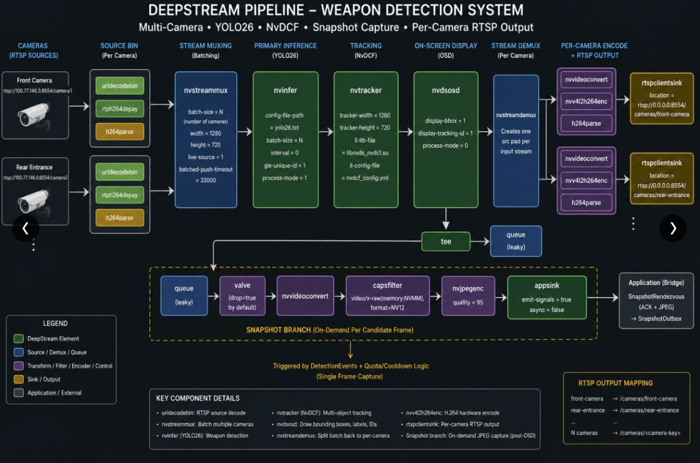
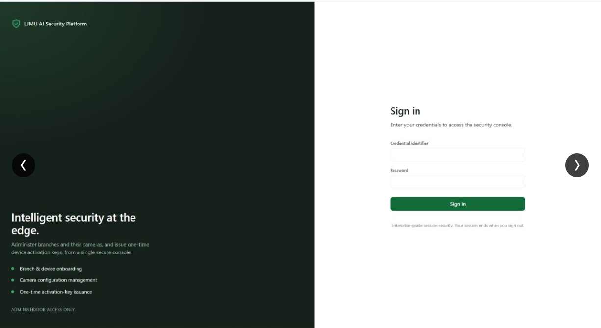
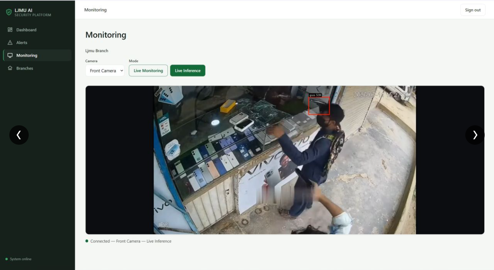
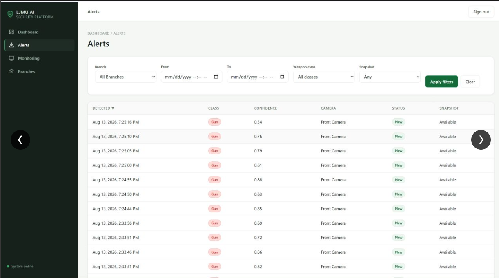
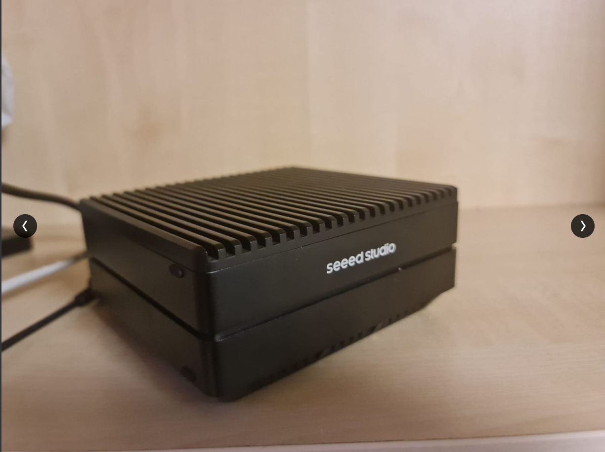

# Edge-Based Weapon Detection Platform

An AI security system that watches CCTV camera feeds and automatically raises an alert the moment
a gun or knife appears on screen — without sending video to the cloud.

## The idea

Most CCTV systems only record. Nobody is watching every camera, every second, so a weapon can be
in frame for a long time before a human notices. This project puts the "watching" on a small
computer at the store or branch itself (an NVIDIA Jetson), so detection happens instantly, on-site,
even if the internet connection drops.

In plain terms:

1. A camera streams video into a small edge device (a Jetson) installed at the branch.
2. The device runs a real-time object-detection AI model that looks for guns and knives in every
   frame.
3. When a weapon is detected, the device grabs a snapshot as evidence and sends an alert to a
   central backend.
4. Security staff see the alert — with live video, a snapshot, and a timestamp — in a web
   dashboard, from anywhere.

## How it fits together

```
Camera → Jetson edge device (AI detection) → Backend API → Web dashboard (security staff)
```

- **Edge device (Jetson):** runs the camera pipeline and the weapon-detection AI model locally, so
  detection keeps working even without internet.
- **Backend:** a central server that manages branches, cameras, devices, and stores alerts.
- **Frontend:** the dashboard where staff log in, watch cameras live, and review alerts.



## What it looks like

**Sign in** — administrators sign in to manage branches, cameras, and issue device activation
keys.



**Live monitoring** — watch any camera live, with detections drawn on screen as they happen.



**Alerts** — every detection is logged with the time, weapon type, confidence score, camera, and
an evidence snapshot.



**The hardware** — an NVIDIA Jetson edge device (Seeed reComputer) is what actually runs the AI
model at each branch.



## Project layout

| Folder | What it is |
|---|---|
| [`agent/`](agent/README.md) | The software that runs on the Jetson edge device |
| [`backend/`](backend/README.md) | The central API and database |
| [`frontend/`](frontend/README.md) | The web dashboard |
| [`deployment/`](deployment/README.md) | Scripts to run and deploy everything |
| `docs/` | Requirements, architecture, and validation reports |
| `specs/` | Feature specs and implementation plans for each piece of work |
| `design/` | UI design system and screen references |
| `postman/` | API request collection for manual testing |

Each folder above with a README link explains that part of the system on its own — what it does,
how it's built, and how to run it.

## This is a dissertation project

Built as part of an MSc dissertation exploring real-time weapon detection on edge hardware for
retail/branch security, rather than relying on cloud video analysis.
